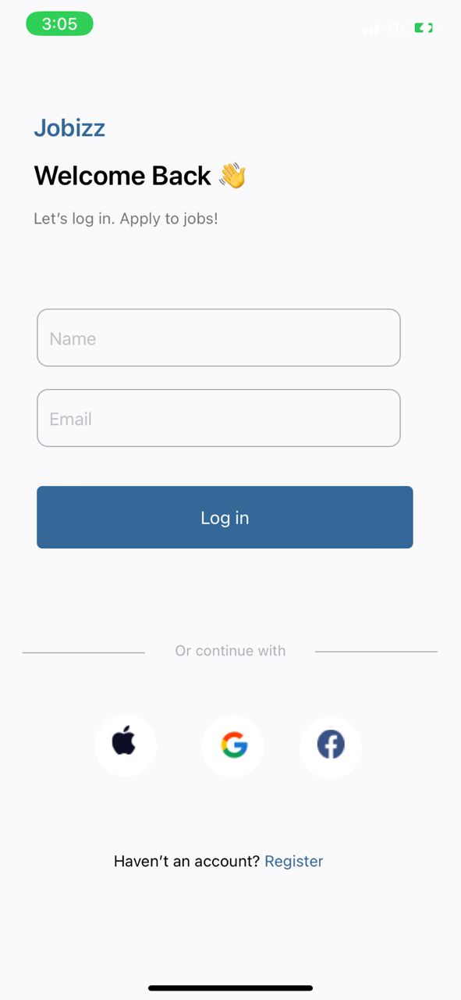
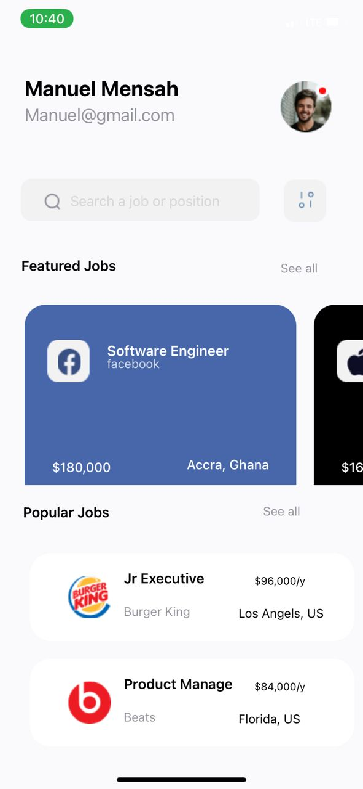
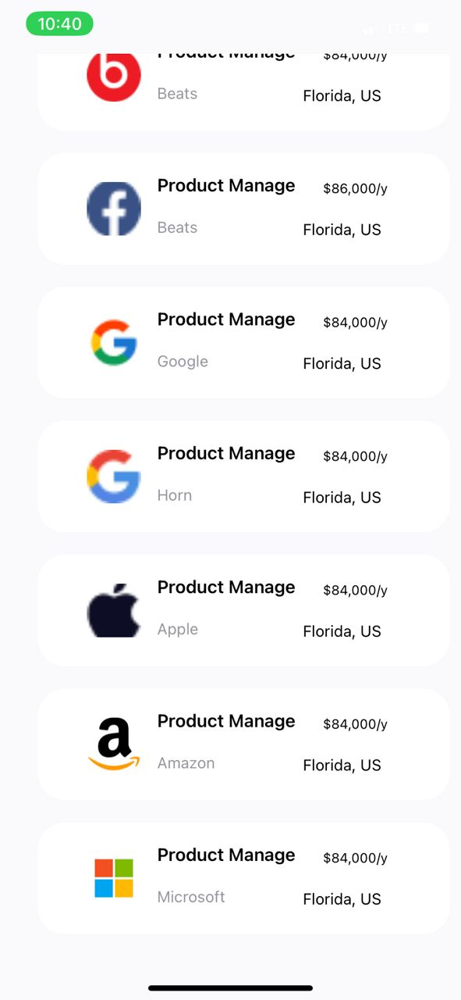
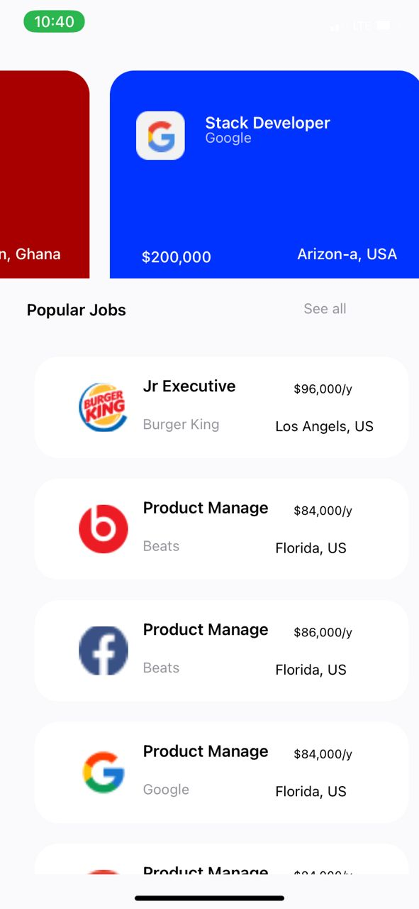

# rn-assignment4-11117467


## Project Overview

This project is a React Native application designed to replicate a provided UI mockup. The application consists of a login screen where users can enter their name and email, which are then passed to the home screen. The home screen displays the user's name and email along with lists of popular and featured job cards.

## Table of Contents

1. [Installation](#installation)
2. [Project Structure](#project-structure)
3. [Components](#components)
    - [LoginScreen](#loginscreen)
    - [HomeScreen](#homescreen)
    - [JobCard](#jobcard)
4. [Screenshots](#screenshots)
5. [Usage](#usage)
6. [Features](#features)
7. [Contributing](#contributing)
8. [License](#license)
9. [Author](#author)

## Installation

To run this project locally, follow these steps:

1. **Clone the repository:**
   ```sh
   git clone https://github.com/your-username/rn-assignment4-ID.git
   cd rn-assignment4-ID


Sure, I understand. Let's provide a more detailed explanation of each component and the project in the README file.

markdown
Copy code
# React Native Assignment 4

## Project Overview

This project is a React Native application designed to replicate a provided UI mockup. The application consists of a login screen where users can enter their name and email, which are then passed to the home screen. The home screen displays the user's name and email along with lists of popular and featured job cards.

## Table of Contents

1. [Installation](#installation)
2. [Project Structure](#project-structure)
3. [Components](#components)
    - [LoginScreen](#loginscreen)
    - [HomeScreen](#homescreen)
    - [JobCard](#jobcard)
4. [Screenshots](#screenshots)
5. [Usage](#usage)
6. [Features](#features)


## Installation

To run this project locally, follow these steps:

1. **Clone the repository:**
   ```sh
   git clone https://github.com/your-username/rn-assignment4-ID.git
   cd rn-assignment4-ID
Install dependencies:

sh
Copy code
npm install
Start the project:

sh
Copy code
expo start
Project Structure
The project structure is organized as follows:


## Components
### LoginScreen
The LoginScreen component is the first screen users will see when they open the app. It allows users to enter their name and email address. When the login button is pressed, it navigates to the HomeScreen and passes the entered name and email as parameters. This component includes:

- State management: Uses the useState hook to manage the values of the name and email input fields.
- TextInput components: For capturing user input.
- Button component: Triggers the navigation to the HomeScreen.
Props:
- navigation: Used to navigate to the HomeScreen.
Functionality:
- handleLogin: This function is called when the login button is pressed. It uses the navigation prop to navigate to the HomeScreen, passing the name and email as parameters.
HomeScreen
- The HomeScreen component displays the user's name and email, along with two sections of job cards: popular jobs and featured jobs. This screen demonstrates how to pass data between screens and how to use the FlatList component to render lists of items.

## Props:
- route: Contains the parameters passed from the LoginScreen (name and email).
State:
- popularJobs: An array of popular job objects, each with an id, title, and description.
- featuredJobs: An array of featured job objects, each with an id, title, and description.
- Functionality:
- FlatList: Used to render lists of popular and featured jobs. Each item in the list is rendered using the JobCard component.
## JobCard
-The JobCard component is a functional component that displays the details of a job (title and description). It is used within the HomeScreen to render each job card in the popular and featured job lists.

### Props:
- job: An object containing the job's details (id, title, and description).
Functionality:
- Displays job details: The JobCard component takes the job prop and displays its title and description in a styled card format.
Screenshots


## Usage
### Login:

Enter your name and email address on the login screen.
Press the login button to navigate to the home screen.
Home Screen:

- View your name and email displayed at the top.
- Browse the lists of popular and featured job cards.
Features
- Login functionality: Capture user input and navigate between screens.
Data passing: Pass user data (name and email) from the login screen to the home screen.
- Job listing: Display lists of popular and featured jobs using reusable components.
Responsive design: The app is styled to match the provided UI mockup.
Contributing

### Screenshots
 







